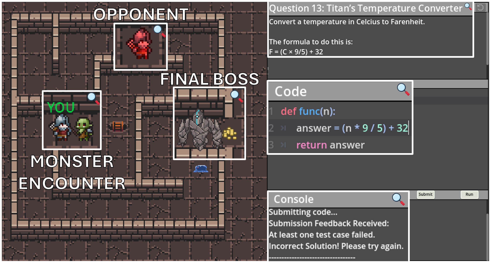
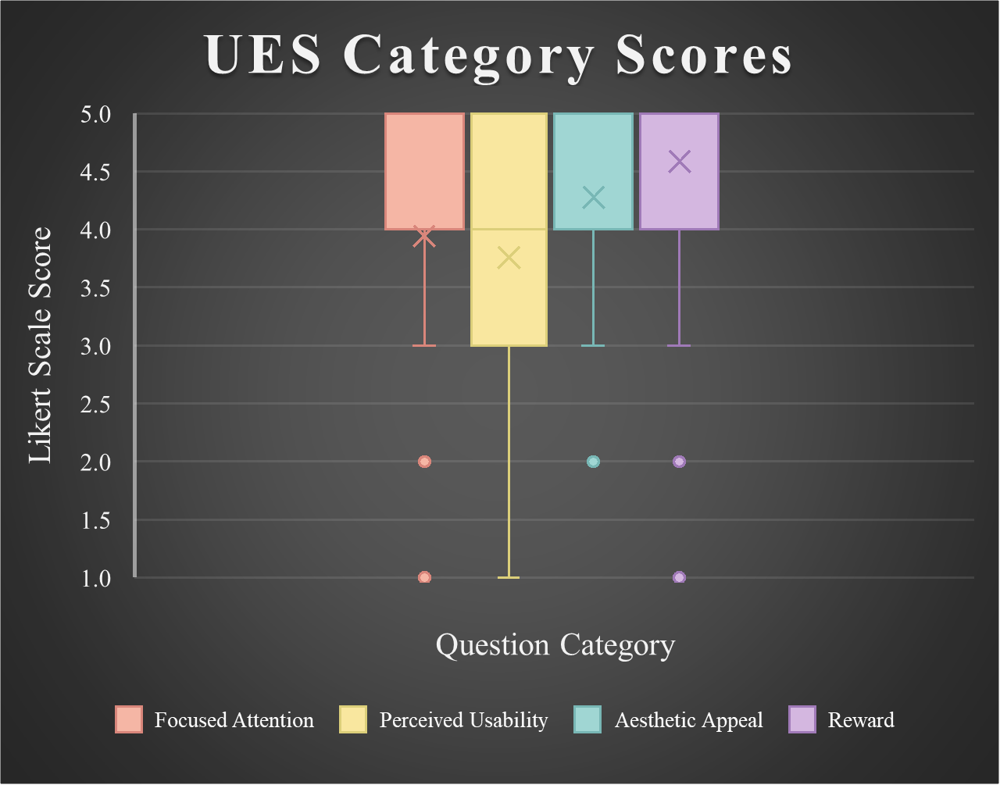
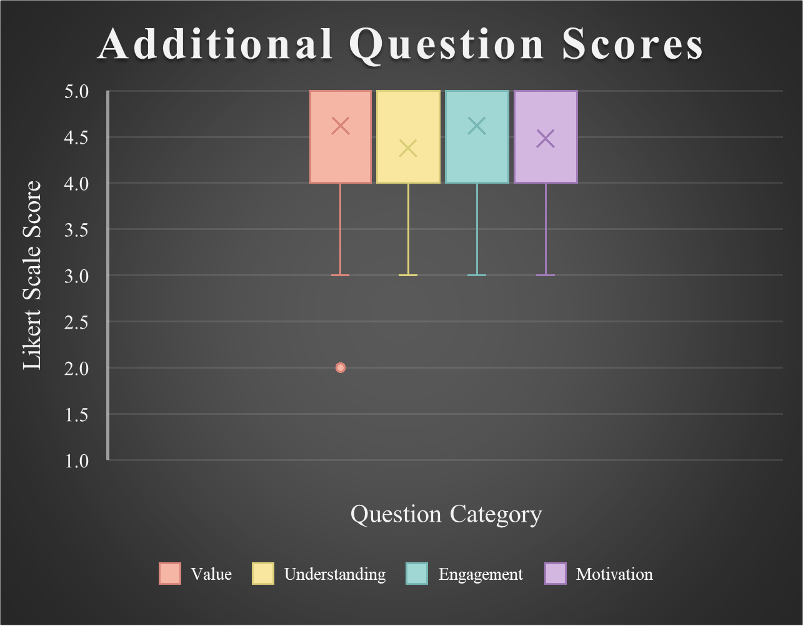

# Dungeons and Developers 
**Real-Time, Competitive Programming Game designed to test its effect on motivation and engagement for 1st year Comp Sci students. UCT Honours in Computer Science Project**

## 1v1 Gamemode  
Engage in one-on-one battles where wit and pace determine the victor. Beat each monster (easy, medium, and hard question) in the maze and claim the treasures that await at the end.

  

- Navigate a **procedurally‑generated maze**.  
- Defeat **monsters** using **Python** coding challenges.  
- Compete against **one other player**.  
- **Reach the exit first to win!**  
- Simple code commands to **traverse the maze**.  
- Opponent’s position updates in **real‑time**.  
- **Robust code interface** with syntax highlighting and detailed feedback.  
- Competitive integrity ensured by **identical mazes and initial questions**.  
- Players get **stunned** for incorrect submissions or hitting a wall.

## Architecture  

### Server  
- Hosts a single game at a time.  
- Handles network connections, maze and monster generation, and position synchronizations.  
- Automatically resets itself after the game ends.  

### Client  
- Handles maze movement, animations, and music.  
- Submits code to the backend for running and testing.  
- Sends updated position to the opponent.  

## Research Findings  
A detailed research study was conducted with a survey evaluating how students engaged with different gameplay modes and question types within the game. 29 first-year Computer Science students from the University of Cape Town participated in the study. Participants completed a comprehensive survey consisting of 17 Likert-scale questions divided across several focus areas: 
- User Engagement Scale (UES)
-- Focused Attention
-- Perceived Usability
-- Aesthetics
-- Reward
- Additional Questions
-- Value
-- Understanding
-- Engagement
-- Motivation

Overall, results were very promising. The **Value**, **Engagement**, and **Reward** metrics recorded the highest mean scores of **4.62**, **4.62**, and **4.59** respectively — indicating students found the experience highly fulfilling.  
**Perceived Usability** had the lowest mean score of **3.76**, suggesting an area for future improvement (potentially addressing a few technical issues or confusion around initial game mechanics).  
Participants reported having higher motivation to solve programming problems in the game than in traditional assignments, thereby affirming the game’s core educational goal.

### 1v1 Mode Survey Results 

  
  

| UES Metric           | Average Score |
|----------------------|--------------|
| Focused Attention     | 3.94         |
| Perceived Usability   | 3.76         |
| Aesthetics            | 4.28         |
| Reward                | 4.59         |
| Learning              | 4.50         |
| Motivation            | 4.55         |

### User‑suggested Improvements  
- Shorten move commands for faster gameplay.  
- Add real‑time error checking to the coding interface for immediate feedback.  
- Increase complexity of the maze and add more monsters for continued challenge.

## Deliverables  
### Final Report  
_**Evaluating Real‑Time Competitive Game‑based Learning in Introductory Computer Science**_  
Download link: (see repository assets)  
### Literature Review  
_**Investigating The Use of Games and Gamification in Computer Science Education**_  
Download link: (see repository assets)  

## University 
University of Cape Town (UCT)  
Department of Computer Science  
Website: https://sit.uct.ac.za  
Email: dept@cs.uct.ac.za  
Tel: 021 650 2663  
